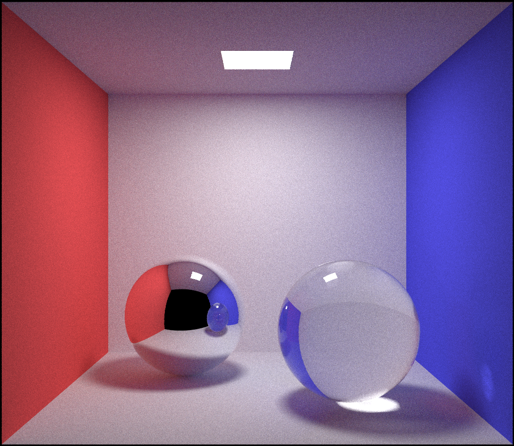

# Path Tracer

This is a lightweight Path Tracer which implement Monte Carlo Integration and multiple importance sampling. It refers to Physically Based Rendering, Third Edition. 

Please refer to `document.pdf` for detail information.

### Dependencies

* Eigen

### Usage

On macOS, open the XCode project, add `Eigen` to header search path, then you can run it. If you want to speed up rendering by `OpenMP`, you need to config for it. 

You can modify `config.txt` to generate different result. The scene number at the first line must be 1 or 2.

### Examples

Now this path tracer can render 2 scenes, the results are shown below.

 

It is much faster than smallpt and produces much bertter result on scene 2.

More features are being developed.